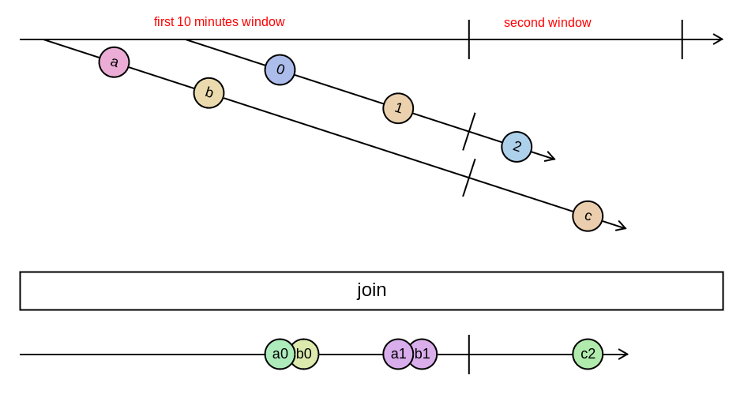

# poc-quarkus-streams

No database, only kafka topics.

## Kafka streams

### use join (inner join)

```java
var builder = new StreamsBuilder();

var valueSerde = new ObjectMapperSerde<>(Crypto.class);
var orderSerde = new ObjectMapperSerde<>(Order.class);
var keySerde = Serdes.String();
var executedOrderSerde = new ObjectMapperSerde<>(ExecutedOrder.class);

var values = builder.stream(
    "crypto-values",
    Consumed.with(keySerde, valueSerde))
    // use crypto name as key
    .map((key, payload) -> KeyValue.pair(payload.getName(), payload));

var orders = builder.stream(
    "crypto-orders",
    Consumed.with(keySerde, orderSerde))
    // use crypto name as key
    .map((key, payload) -> KeyValue.pair(payload.getCrypto(), payload));

// join values and orders streams will publish on a third topic
values.join(orders,
    (value, order) -> ExecutedOrder.builder()
        .crypto(value.getName())
        .unitPrice(value.getPrice())
        .quantity(order.getQuantity())
        .build(),
    JoinWindows.ofTimeDifferenceWithNoGrace(Duration.ofMinutes(10)),
    StreamJoined.with(keySerde, valueSerde, orderSerde))
    .to("executed-orders", Produced.with(keySerde, executedOrderSerde));

return builder.build();
```



## Local run

```shell
make package
make up
```

And use 'api.http' to execute http calls.

## Aggregation / join topic by id

Crypto events

TODO:

1. [x] create a first topic that emit cryptos values events
2. [x] ~~create a console application that emit on it every 1 seconds, print to console the cryptos' values~~ create an endpoint in an independent application module
3. [x] create a second topic that emit an order event (buy or sell)
4. [x] create a rest endpoint to manually emit the order
5. [x] create a topology that aggregate the 2 previous topics, join by crypto id, and emit on a third topic the execute order event
6. [x] consume only the last crypto-values for joining the 2 topics
7. [x] consume the third topic
8. [x] test different windowing
9. [ ] write integration tests
10. [ ] write unit tests
11. [ ] use avro for crypto-values and crypto-orders topics
12. [ ] validate topic 1 and 2 retention management
13. [ ] check filesystem persistence

## Event sourcing

Transactions on a bank account.

TODO:

1. [ ] use the previous aggregate topic of executed order event and apply transactions an account
2. [ ] read historic, multiple times
3. [ ] create snapshot
4. [ ] remove events from a key
